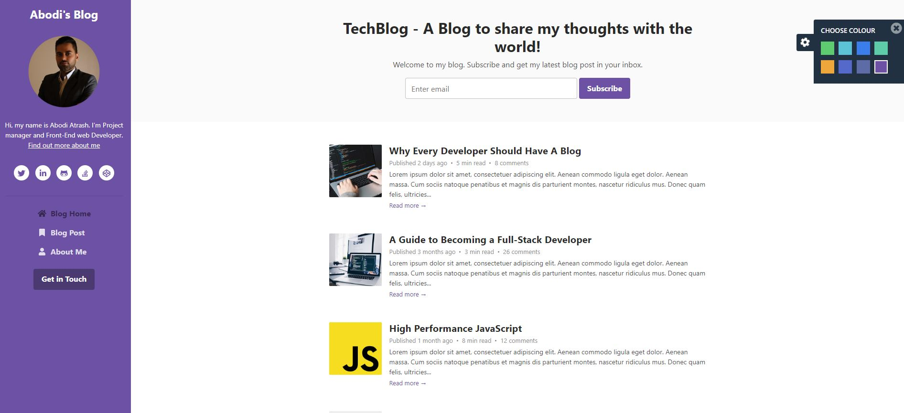

## Colour Schemes

#### Colour 1 (theme-1.css)

#### Colour 2 (theme-2.css)

#### Colour 3 (theme-3.css)

#### Colour 4 (theme-4.css)

#### Colour 5 (theme-5.css)

#### Colour 6 (theme-6.css)

#### Colour 7 (theme-7.css)

#### Colour 8 (theme-8.css)

## Features

-  Fully Responsive
-  HTML5 + CSS3
-  Built on Bootstrap 4
-  **SCSS** source files included
-  8 Colour Schemes
-  1000+ FontAwesome 5 icons
-  Compatible with all modern browsers

